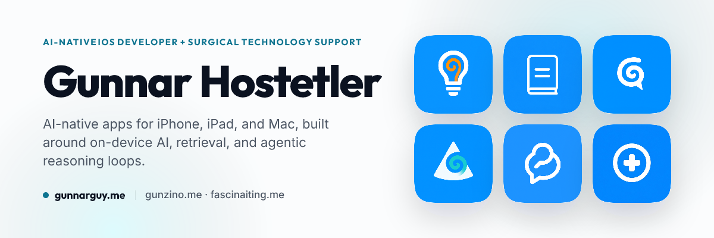

<a href="https://gunnarguy.me">
  <picture>
    <source media="(prefers-color-scheme: dark)" srcset="assets/banner-dark.png">
    
  </picture>
</a>

  <a href="https://gunnarguy.me"><strong>gunnarguy.me</strong></a> &nbsp;·&nbsp;
  <a href="https://gunzino.me">gunzino.me</a> &nbsp;·&nbsp;
  <a href="https://fascinaiting.me">fascinaiting.me</a> &nbsp;·&nbsp;
  <a href="https://www.linkedin.com/in/gunnar-hostetler/">LinkedIn</a> &nbsp;·&nbsp;
  <a href="mailto:Gunnarguy@me.com">Gunnarguy@me.com</a>

**I build Apple-native apps that turn dense, messy information into something you can search, inspect, and trust.**

I build AI-native iOS apps. Five are on the App Store, built around on-device AI, retrieval, and agentic reasoning loops. The rest of my time, I'm in the operating room: intraoperative technical support for Stryker at the VA in Palo Alto, in the room with Stanford surgical teams. Every app I've built started as an idea, which led to a question, which led to a doc or two, which led to a prototype, which led to more questions, and so on until it finally worked.

Everything here is built and shipped solo.

## On the App Store

<table>
<tr>
<td width="150" align="center" valign="top">

</td>
<td valign="top">
<h3><a href="https://gunnarguy.me/projects/openintelligence/">OpenIntelligence</a></h3>

FLAGSHIP &nbsp;·&nbsp; iPhone, iPad, and Mac &nbsp;·&nbsp; on the App Store since January 2026 &nbsp;·&nbsp; open source

An open-source private document intelligence app for iPhone, iPad, and Mac. It turns files and media into searchable libraries, answers with inspectable citations, and shows which execution route actually ran. Reading, indexing, retrieval and verification all run on device, every claim is cited and inspectable, and the app abstains when the sources do not support an answer.

&nbsp;

<a href="https://github.com/Gunnarguy/OpenIntelligence">Source</a> &nbsp;·&nbsp;
<a href="https://gunnarguy.me/projects/openintelligence/">Deep dive</a> &nbsp;·&nbsp;
<a href="https://gunnarguy.me/projects/openintelligence/#how-i-know-if-it-actually-works">How I know if it actually works</a> &nbsp;·&nbsp;
<a href="https://gunnarguy.me/projects/openintelligence/research/">Research notes</a> &nbsp;·&nbsp;
<a href="https://gunnarguy.me/projects/openintelligence/#docs">Docs</a> &nbsp;·&nbsp;
<a href="https://fascinaiting.me">Interactive showcase</a> &nbsp;·&nbsp;
<a href="https://gunzino.notion.site/OpenIntelligence-Public-Roadmap-e4446012bb8940e6b78a745aee688075">Public roadmap</a> &nbsp;·&nbsp;
<a href="https://www.youtube.com/playlist?list=PLG7ayF50szdiUIeF8gm7p4PhzXzQ_wUkR">Demos</a> &nbsp;·&nbsp;
<a href="https://gunzino.me/openintelligence/">Product site</a>

</td>
</tr>
<tr>
<td width="150" align="center" valign="top">

</td>
<td valign="top">
<h3><a href="https://gunnarguy.me/projects/openmanual/">OpenManual</a></h3>

iPhone and iPad &nbsp;·&nbsp; on the App Store since September 2026 &nbsp;·&nbsp; source private

Point your phone at a device, appliance, tool, vehicle, or other documented thing. OpenManual identifies the exact unit, finds the manufacturer documentation that applies to that device and revision, and answers "How do I ___?" using only that document, with page-level citations. No OpenManual backend. No account. No API key. Camera frames and imported PDFs stay on the iPhone.

<a href="https://apps.apple.com/app/apple-store/id6804523993?pt=127101782&ct=GitHub_Profile&mt=8">App Store</a> &nbsp;·&nbsp;
<a href="https://gunnarguy.me/projects/openmanual/">Deep dive</a> &nbsp;·&nbsp;
<a href="https://gunzino.me/openmanual/">Product site</a>

</td>
</tr>
</table>

<table>
<tr>
<td width="33%" valign="top">

<h3 align="center"><a href="https://gunnarguy.me/projects/openresponses/">OpenResponses</a></h3>

iPhone and iPad &nbsp;·&nbsp; on the App Store since January 2026

An iOS/iPadOS App built around the OpenAI Responses API. Native computer use and MCP connectors, passed App Review on the first try. Version 2.6 adds an API Workbench, OAuth-connected MCP accounts, and voice that keeps listening.

<a href="https://apps.apple.com/app/apple-store/id6757338355?pt=127101782&ct=GitHub_Profile&mt=8">App Store</a> &nbsp;·&nbsp;
<a href="https://github.com/Gunnarguy/OpenResponses">Source</a> &nbsp;·&nbsp;
<a href="https://gunnarguy.me/projects/openresponses/">Deep dive</a> &nbsp;·&nbsp;
<a href="https://gunzino.me/openresponses/">Product site</a>

</td>
<td width="33%" valign="top">

<h3 align="center"><a href="https://gunnarguy.me/projects/opencone/">OpenCone</a></h3>

iPhone &nbsp;·&nbsp; on the App Store since May 2025

An iOS App that meshes the OpenAI Completions API and the Pinecone API together to form a RAG client for testing multi-index document search, later updated to use the Responses API. The Pinecone iOS client that didn't exist, with on-device PDF and OCR chunking.

<a href="https://apps.apple.com/app/apple-store/id6744467668?pt=127101782&ct=GitHub_Profile&mt=8">App Store</a> &nbsp;·&nbsp;
<a href="https://github.com/Gunnarguy/OpenCone">Source</a> &nbsp;·&nbsp;
<a href="https://gunnarguy.me/projects/opencone/">Deep dive</a> &nbsp;·&nbsp;
<a href="https://gunzino.me/opencone/">Product site</a>

</td>
<td width="33%" valign="top">

<h3 align="center"><a href="https://gunnarguy.me/projects/openassistant/">OpenAssistant</a></h3>

ARCHIVED &nbsp;·&nbsp; iPhone and iPad &nbsp;·&nbsp; on the App Store since October 2024

My first shipped iOS App, built around the OpenAI Assistants v2 API. Engineered to handle vector stores, document uploads, active run polling, and strategy-driven local file preprocessing. Where I learned to ship: App Store approved after 30 rejections taught me the reviews. Archived now that the Assistants API is deprecated.

<a href="https://apps.apple.com/app/apple-store/id6692613772?pt=127101782&ct=GitHub_Profile&mt=8">App Store</a> &nbsp;·&nbsp;
<a href="https://github.com/Gunnarguy/OpenAssistant">Source</a> &nbsp;·&nbsp;
<a href="https://gunnarguy.me/projects/openassistant/">Deep dive</a> &nbsp;·&nbsp;
<a href="https://gunzino.me/openassistant/">Product site</a>

</td>
</tr>
</table>

## Prototype

<table>
<tr>
<td width="150" align="center" valign="top">

</td>
<td valign="top">
<h3><a href="https://gunnarguy.me/projects/openclinic/">OpenClinic</a></h3>

iPhone and iPad &nbsp;·&nbsp; proof of concept, not production medical software &nbsp;·&nbsp; open source

An EHR prototype iOS/iPadOS App for exploring local-first retrieval around chart-shaped patient data. SMART on FHIR over OAuth, pulled into on-device SwiftData, answered with citations. I wanted to see what would happen if I applied the same OpenIntelligence engine to clinical information.

<a href="https://github.com/Gunnarguy/OpenClinic">Source</a> &nbsp;·&nbsp;
<a href="https://gunnarguy.me/projects/openclinic/">Deep dive</a>

</td>
</tr>
</table>

## How I build

Native when it matters. Local when it can be. Sources visible when an answer needs to be trusted.

- **Apple platforms:** Swift, SwiftUI, Vision, PDFKit, Core ML, Foundation Models, App Intents, and the frameworks already on the device.
- **Retrieval:** OCR, chunking, embeddings, reranking, citations, SQLite, Qdrant, Pinecone, and document-scoped search.
- **Models and tools:** OpenAI Responses API, Apple Intelligence, Gemini, MCP, computer use, and direct API integrations.
- **Data and interoperability:** FHIR, SMART on FHIR, REST, streaming, structured local stores, and user-controlled files.
- **Shipping:** Xcode, tests, GitHub Actions, privacy reviews, App Store delivery, and documentation that stays close to the code.

## Also on GitHub

- [PlaudBlender](https://github.com/Gunnarguy/PlaudBlender) — Local-first Plaud recording pipeline and personal knowledge timeline with Python, SQLite, Qdrant, RAG, 3D graphs, MCP tools, and a SwiftUI companion.
- [OpenCore](https://github.com/Gunnarguy/OpenCore) — An evidence-native runtime for personal intelligence. Bitemporal claims, inspectable beliefs, and receipts for every answer.
- [USB](https://github.com/Gunnarguy/USB) — Native macOS SwiftUI USB inspector using IOKit and Disk Arbitration for device enumeration, descriptors, power, speed, storage health, and live I/O activity.
- [Microphone](https://github.com/Gunnarguy/Microphone) — Native SwiftUI microphone testing and profiling suite for iPhone, Mac, and Apple Watch with spectrum analysis, frequency response, latency, noise, speech clarity, and exportable reports.
- [WoWCA](https://github.com/Gunnarguy/WoWCA) — Offline-first Classic Era item and spell database for iPhone, iPad, and Apple Vision Pro, built with SwiftUI, SQLite FTS5, and a reproducible data pipeline.

## Where things live

| Site | Role | What you'll find |
|---|---|---|
| [**gunnarguy.me**](https://gunnarguy.me) | The Creator | Everything I build, grouped by status, with a deep dive, research notes, and docs for each app. |
| [**gunzino.me**](https://gunzino.me) | The Publisher | The apps on the App Store: product pages, support, and privacy. |
| [**fascinaiting.me**](https://fascinaiting.me) | The Platform | The OpenIntelligence showcase: how it works under the hood, the live roadmap, the release history, and the guides. |

  <a href="https://gunnarguy.me"><strong>See the rest of my work at gunnarguy.me →</strong></a>

